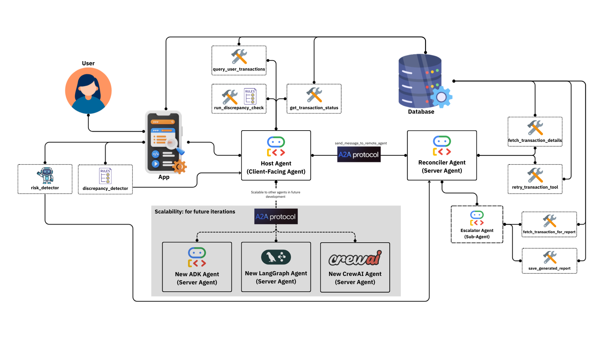

# SPARK - Service Proactive AI Response Knowledge


## 🚀 Overview



SPARK is a sophisticated multi-agent AI system designed for Bank of the Philippine Islands (BPI) to proactively detect and resolve transactional anomalies like "floating cash". Built with **Google's Agent Development Kit (ADK)** and the **A2A (Agent-to-Agent) Protocol**, this system demonstrates state-of-the-art patterns for building collaborative AI agents that can automatically resolve transaction discrepancies.

### The Innovation

SPARK creates an intelligent bridge between users and contact centers, transforming how banking issues are resolved while empowering both sides of the customer service equation.

**For Users**, SPARK provides:
- Immediate problem detection before they even notice
- Automatic resolution attempts while they go about their day
- Clear, proactive communication about their transaction status
- No more waiting on hold or explaining issues repeatedly

**For Contact Centers**, SPARK delivers:
- Pre-analyzed, comprehensive case reports when human intervention is needed
- Reduced call volume by resolving routine issues automatically
- Agents receive enriched context, not just "my payment failed"
- More time to focus on complex cases that truly need human expertise

Think of SPARK as your banking guardian angel - it works quietly in the background, catching problems early, fixing what it can, and when it can't, it ensures that both you and the contact center agent have everything needed for a quick resolution. The agent no longer needs to ask "what happened?" because SPARK has already documented the entire journey.

Starting with "floating cash" transactions, we're proving that AI doesn't replace human connection - it enhances it, making every interaction more meaningful and efficient. Scale this approach across hundreds of banking scenarios, and we're not just solving problems; we're preventing frustration before it begins.

### Security Architecture

Unlike traditional multi-agent systems where all agents are tightly coupled, SPARK uses the A2A protocol to maintain security through separation:

- **Confidential agents** (like the Reconciler) run on BPI's secure infrastructure
- **Representative agents** (like the Host) are deployed on the user side
- Agents communicate remotely via secure A2A protocol
- No sensitive business logic is exposed to client applications
- Each agent runs in its own isolated environment

## 📋 Requirements

### System Requirements
- **Python**: 3.11 or higher
- **Node.js**: 16+ (for frontend)
- **PostgreSQL**: Cloud or local server
- **Operating System**: Windows, macOS, or Linux

### Python Package Management
- **uv**: Modern Python package manager (recommended)
- **pip**: For initial setup

## 🛠️ Quick Setup

### 1. Clone the Repository
```bash
git clone https://github.com/yourusername/spark-agent.git
cd spark-agent
```

### 2. Environment Configuration
Copy the environment template and configure:
```bash
cp .env.example .env
```

Edit `.env` with your credentials:
```env
# Google AI Configuration (choose one)
GOOGLE_API_KEY="your_api_key_here"
# OR for Vertex AI:
GOOGLE_GENAI_USE_VERTEXAI=TRUE
GOOGLE_CLOUD_PROJECT=your_project_id
GOOGLE_CLOUD_LOCATION=us-central1

# PostgreSQL Database Configuration
DB_NAME=your_database_name
DB_HOST=localhost
DB_PORT=5432
DB_USER=your_db_user
DB_PASSWORD=your_db_password

# Optional: Development User
DUMMY_USER_ID=test_user_123
```

### 3. Python Environment Setup

#### Option A: Using venv
```bash
# Create virtual environment
python -m venv venv

# Activate virtual environment
# On Windows:
venv\Scripts\activate
# On macOS/Linux:
source venv/bin/activate

# Install dependencies
pip install -r requirements.txt
pip install uv  # Install uv package manager
```

#### Option B: Using Conda
```bash
# Create conda environment
conda create -n spark python=3.11
conda activate spark

# Install dependencies
pip install -r requirements.txt
pip install uv  # Install uv package manager
```

### 4. Agent Dependencies Setup
```bash
# Setup Host Agent
cd agents/host_agent_adk
uv venv
uv sync
cd ../..

# Setup Reconciler Agent
cd agents/reconciler_agent
uv venv
uv sync
cd ../..
```

### 5. Frontend Setup
```bash
cd frontend
npm install
cd ..
```

## 🚦 Running the Complete System

**Important**: Run each component in a separate terminal window. Ensure your Python environment is activated in each terminal.

### Terminal 1: Reconciler Agent
```bash
cd agents/reconciler_agent
uv run --active .
```

### Terminal 2: Host Agent API
```bash
cd agents/host_agent_adk
uv run python run_api.py
```

### Terminal 3: Frontend Backend Server
```bash
cd frontend
npm run server
```

### Terminal 4: React Frontend
```bash
cd frontend
npm run dev
```

**Alternative for Frontend**: Run both frontend and backend in one terminal:
```bash
cd frontend
npm run dev:all
```

## 🏗️ System Architecture

```
┌──────────────────────────────────────────────────────────┐
│                    User Interface                        │
│                     React + Vite                         │
└────────────────────┬─────────────────────────────────────┘
                     │
┌────────────────────▼─────────────────────────────────────┐
│                 Express Backend Server                   │
└────────────────────┬─────────────────────────────────────┘
                     │
┌────────────────────▼─────────────────────────────────────┐
│                     Host Agent                           │
│                  Google ADK + API                        │
│            • Anomaly Detection (ML Models)               │
│            • User Interface Bridge                       │
│            • Database Query Sandboxing                   │
└────────────────────┬─────────────────────────────────────┘
                     │ A2A Protocol
┌────────────────────▼─────────────────────────────────────┐
│                  Reconciler Agent                        │
│            • Transaction Retry Logic                     │
│            • Status Management                           │
│            • Report Generation Trigger                   │
└────────────────────┬─────────────────────────────────────┘
                     │ Sub-agent
┌────────────────────▼─────────────────────────────────────┐
│                  Escalator Agent                         │
│                    (Sub-agent)                           │
│            • SUCCESS Report Generation                   │
│            • ESCALATION Report Creation                  │
│            • Database Report Storage                     │
└──────────────────────────────────────────────────────────┘
```

## 📁 Project Structure

```
spark-agent/
├── README.md                      # This file
├── CLAUDE.md                      # AI assistant guidance
├── requirements.txt               # Python dependencies
├── .env.example                   # Environment template
├── .env                          # Your configuration (create this)
│
├── agents/                        # Multi-agent system
│   ├── README.md                 # Agent system documentation
│   ├── direct_client.py          # Direct A2A client example
│   ├── host_agent_adk/           # Primary user-facing agent
│   │   ├── agent.py
│   │   ├── api_server.py
│   │   ├── run_api.py
│   │   └── tools/
│   ├── TEST_host_agent_adk/      # Test results for host agent
│   └── reconciler_agent/         # Transaction resolution agent
│       ├── __main__.py
│       ├── agent.py
│       └── sub_agents/
│           └── escalator_agent/  # Report generation sub-agent
│
├── frontend/                      # React application
│   ├── README.md                 # Frontend documentation
│   ├── package.json
│   ├── vite.config.js
│   ├── server.js                 # Express backend
│   ├── src/
│   │   ├── components/           # React components
│   │   ├── pages/               # Application pages
│   │   └── services/            # API services
│   └── public/
│
└── models/                        # ML models and notebooks
    ├── README.md                 # Models documentation
    ├── notebooks/                # Google Colab notebooks
    │   ├── 1_synthetic_data_generation.ipynb
    │   ├── 2_EDA.ipynb
    │   ├── 3_Trials.ipynb
    │   └── 4_experimentation.ipynb
    ├── datasets/                 # Synthetic data (generated)
    │   ├── transactions_fixed.csv
    │   └── user_wallet_balances.csv
    ├── trybe_discrepancy_detector.pkl  # Rule-based detector
    ├── trybe_risk_predictor.pkl        # ML risk model
    ├── trybe_models.py                 # Model utilities
    └── trybe_inference_demo.ipynb      # Demo notebook
```

## 🔑 Key Features

### Intelligent Transaction Monitoring
- **Real-time anomaly detection** using machine learning models
- **Rule-based discrepancy detection** for known patterns
- **Risk assessment** for transaction prioritization

### Automated Resolution
- **Smart retry logic** with configurable attempts (RT1_, RT2_ prefixes)
- **Automatic status updates** for successful resolutions
- **Comprehensive reporting** for both successes and escalations

### Secure Multi-Agent Architecture
- **A2A Protocol** for secure agent-to-agent communication
- **Sandboxed database access** preventing cross-user data exposure
- **Separated deployment** of confidential and public agents

### User Experience
- **Modern React interface** with real-time updates
- **Mobile-first responsive design**
- **Multilingual support** (English/Tagalog)
- **No manual intervention required** for most issues

## 🔍 Troubleshooting

### Common Issues

**Database Connection Failed**
- Verify PostgreSQL is running
- Check `.env` database credentials
- Ensure database exists and user has permissions

**Agent Communication Errors**
- Confirm all agents are running on correct ports
- Check firewall settings
- Verify A2A protocol messages in logs

**Frontend Not Loading**
- Ensure `npm install` completed successfully
- Check that both frontend and backend servers are running
- Verify API endpoints in browser console

## 📄 License

This project is licensed under the MIT License - see the LICENSE file for details.

## 🙏 Acknowledgments

- **Google Agent Development Kit (ADK)** team for the framework
- **A2A Protocol** contributors for interoperability standards
- **Bank of the Philippine Islands (BPI)** for the use case
- **Google Cloud Platform** for infrastructure support

## 📧 Support

For issues, questions, or contributions:
- Open an issue on GitHub
- Contact the development team
- Check the documentation for detailed guides

---

**Note**: This system is designed for banking environments. Ensure proper security measures and compliance requirements are met before deployment.
